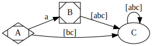
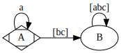
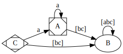
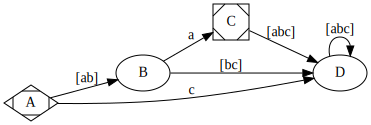
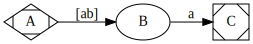
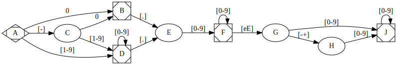

<!--
.. date: 2019-07-01 21:44
.. description: 
.. slug: 
.. title: Düzenli İfade (RegExp) Motorları ve Otomatlar
-->

Geçtiğimiz günlerde, Flex ve Bison ile JSON işlemeye yönelik tutorial yazdım.

 - [Flex ve Bison kullanarak JSON İşleme (1. Kısım)](../yazilim-dunyasi/flex-bison.html)
 - [Flex ve Bison kullanarak JSON İşleme (2. Kısım)](../yazilim-dunyasi/json-kutuphanesi.html)

O iki yazı üzerinde çalışırken, dikkatim düzenli ifade (RegExp) motorları üzerine kaydı.
Bu yazıda, `[-]?(0|[1-9][0-9]*)([.][0-9]+)?([eE][-+]?[0-9]+)?` düzenli ifadesi ile
eşleşecek bir "Deterministic Finite Automata" (ks. DFA, tr; Belirli Sonlu Otomat)
kodlayacağız. 

Düzenli İfadeler ve DFA
=======================

Düzenli ifadeler, metin işleyen programlar için, çok faydalı araçlardır. Örneğin, internet
formlarında, girilen metnin format kurallarına uyup uymadığını test edebilir, metin
belgelerinin içinde e-posta, telefon numarası arayabilir, ya da bir önceki yazıda olduğu
gibi, lexical analiz aracı olarak kullanabilirsiniz.

Düzenli ifadeler, mini bir programlama dili gibidir. `(a|b)+` gibi bir ifade, düzenli
ifade motoru tarafından derlenir, derlenen düzenli ifade, istediğimiz metin üzerinde
arama veya eşleme yapmak için kullanılır.

Düzenli ifade motoru yazmak için, tek bir yol yok. Bu yazıda, metinle eşleme yapmak
için, düzenli ifadeyi bir DFA'ya çevireceğiz. Her ne kadar düzenli ifade motorları
`(a|b)+` gibi bir düzenli ifadeyi otomatik olarak DFA'ya çevirebilse de, bu yazıda
çevirme işlemini manuel olarak yapacağız.

Önce DFA'yı tarif ederek başlayalım. DFA'yı bir makine (automata) gibi düşünebilirsiniz.
Bu makinenin üstünde bazı tuşlar hayal edin. Bu tuşların birine basıldığında, makine bir
durumdan, başka bir duruma geçiyor. Makinenin üzerinde, o an hangi durumda olduğu gösteren
led ışıklar da var. Bu makineyi öyle bir şekilde tasarlayacağız ki, düzenli ifadeyle
eşleşen bir metin tuşladığımızda başarılı ledi yanacak, aksi halde başarısız ledi yanacak.

Bu makineyi oluşturmak için, 5 şeyi bilmemiz gerek.

 - Led Sayısı        (Makine kaç farklı durumda olabilir)
 - Başlangıç Ledi    (Makineyi sıfırladığımızda, hangi led yanacak)
 - Başarılı Ledler   (Ledlerin hangileri başarılı eşleşmeyi gösterecek)
 - Tuşlar            (Makinenin üstünde kaç farklı tuş olacak)
 - Geçiş Tablosu     (Hangi durumda, hangi tuşa basılınca, hangi duruma geçilecek)
 
Bu tarz makineye, Deterministic Finite Automata (DFA) deniyor çünkü;

 - *Deterministic*: Hangi girdiye, hangi sonucu vereceği kesin olarak bellidir.
 - *Finite*       : Makinanın içinde bulunabileceği sınırlı sayıda durum vardır.
 - *Automata*     : Bu bir makina

 
 
Daha net anlaşılması için, basit düzenli ifadeleri, DFA'ya çevirelim.
Örnekler fazla karmaşık olmaması için 3 tuşlu bir makineyle başlayalım.
Bunlar küçük harflerle 'a','b' ve 'c' tuşları olsun. Makinemizde, 3
adet de durum ledi olacak, bunlar da büyük harflerle 'A','B' ve 'C' olsun.
Bu şartlarda, `a` düzenli ifadesi ile eşleşecek bir DFA, aşağıdaki şemaya göre çalışabilir.

Yukarıdaki şemada, 'A' ledi başlangıç durumunu, 'B' ledi başarılı eşleşmeyi,
'C' ledi de başarısız eşlemeyi ifade etsin. Başlangıç durumunda iken, 'a' tuşuna
bastığımızda, 'B' ledini yakacağız. Diğer tüm durumlarda, 'C' ledini yakacağız.
Böylece, tek bir 'a' karakteri kabul eden bir DFA tasarlamış olduk.

Aynı DFA'yı, aşağıdaki tablo ile de gösterebiliriz.

	+-------+---+---+---+
	| Durum | a | b | c |
	+-------+------------
	|  A    | B | C | C |
	+-------+---+---+---+
	|  B    | C | C | C |
	+-------+---+---+---+
	|  C    | C | C | C |
	+-------+---+---+---+

Soldaki sütun, o anki durumu, üst satır, işleyeceğimiz bir sonraki karakteri, hücre
içindeki değerler de, o durumda o karakter işlendiğinde hangi duruma geçileceğini
ifade ediyor.

Bir de, `a*` düzenli ifadesini deneyelim. Burada, sıfır, bir veya daha fazla 'a'
karakteri ile eşleme yapmak istiyoruz. Bunun için de, aşağıdaki şekilde bir DFA
yapabiliriz. Burada, başlangıç ve başarılı ledi 'A' ledi, başarısız ledi 'B' ledi
olsun. 'C' ye ihtiyacımız yok.

Şimdi de, `a+` ifadesine bakalım. Bir öncekinden farkı, en az bir tane
'a' karakterine ihtiyaç duyulması. Aşağıdaki DFA'da, başlangıç 'C',
başarılı 'A' ve başarısız 'B' durumu olsun.

	
Şimdiye kadar yaptığımız örneklerde, tüm durumlar ya başlangıç, ya başarılı
eşleşme ya da hata belirtiyordu. Bunların haricinde, belirsizlik ifade
eden durumlarımız da olabilir. Bu durumlar, eşlemenin sağlanıp sağlanmadığını
tespit edebilmek için, daha fazla karakter okumak gerekir anlamına gelir. Şimdiye
kadar yaptığımız örnekler çok basit olduğu için, böyle bir durumla karşılaşmadık.

`(a|b)a` düzenli ifadesini DFA'ya çevirebilmek için, belirsiz duruma da ihtiyacımız
olacak. Önce 'a' veya 'b' karakteri istiyoruz. Daha sonra 1 tane
daha 'a' karakterine ihtiyacımız var. İlk okuduğumuz karakter 'a' veya 'b' ise,
daha fazla karakter okumadan başarılı veya başarısız bir sonuç bildiremeyiz. Bu düzenli
ifadeyi DFA'ya çevirmek için, dördüncü bir duruma ihtiyacımız olacak. Bu duruma da 'D'
durumu diyelim.

	
DFA'larımız büyüdükçe, başarısız her girdiyi bir noktaya toplamak şemalarımızın
okunmasını zorlaştıracağı için, şemada belirtilmeyen her yolun başarısız durumuna
gittiğini varsayabiliriz. Bu varsayıma dayanarak, yukarıdaki şema ile, aşağıdaki
şema birbirine denk olarak değerlendirilmelidir.

DFA'yı Nasıl Kodlayacağız
=========================

Uygulamada,  "State Machine" (durum makinesi?) kodlamak için
kullanılan en az iki farklı yöntem var. Bunlardan biri, durumlar arasındaki geçişi
bir tabloda göstermek. Bir önceki başlık altında yaptığımız son örneği, bir
tablo ile kodlamak istersek, aşağıdaki gibi kodlayabiliriz.

	:::c
	int ornek_5(char *string)
	{
		char tablo[4][3] = {
				  //  a | b | c
			/* A */ {'B','B','D'},
			/* B */ {'C','D','D'},
			/* C */ {'D','D','D'},
			/* D */ {'D','D','D'},
		};

		int state = 'A'; // Başlangıç
		
		int match_size = 0; // kaç karakter eşledik
		int i = 0;          // kaçıncı karakteri işliyoruz.

		while(state != 'D') // D başarısız durum
		{
			if(state == 'C') // C başarılı durum
				match_size = i;

			state = tablo[state - 'A'][string[i++] - 'a'];
		}

		return i; // kaç karakter eşleyebildiğimizi döndür
	}
	
DFA'yı kodlamak için kullanılabilecek bir diğer yöntem de, durum geçişlerini
`switch` ifadesiyle göstermek. Bunun C kodunda karşılığı da aşağıdaki şekilde
olabilir.

	:::c
	int ornek_5_2(char *string)
	{

		int state = 'A'; // Başlangıç
		
		int match_size = 0; // kaç karakter eşledik
		int i = 0;          // kaçıncı karakteri işliyoruz.

		while(state != 'D') // D başarısız durum
		{
			char c = string[i];
			switch(state)
			{
				case 'A':
					if(c == 'a' || c == 'b')
						state = 'B';
					else
						state = 'D';
				break;
				case 'B':
					if(c == 'a')
						state = 'C';
					else
						state = 'D';
				break;
				case 'C':
				case 'D':
					state = 'D';
				break;
			}

			++i;
		}

		return i; // kaç karakter eşleyebildiğimizi döndür
	}
	
Makrolarla biraz daha okunaklı olarak kodlayabiliriz.

	:::c
	#define SETSTATE(x) {state = (x); goto set_state_end; }
	#define END_OF_CASE SETSTATE(0)
	#define MATCH_FOUND (match_size = i);
	int ornek_5_3(char *string)
	{

		int state = 'A'; // Başlangıç
		
		int match_size = 0; // kaç karakter eşledik
		int i = 0;          // kaçıncı karakteri işliyoruz.

		while(state)
		{
			char c = string[i];
			switch(state)
			{
				case 'A':
					if(c == 'a' || c == 'b') SETSTATE('B')
					END_OF_CASE
				case 'B':
					if(c == 'a') SETSTATE('C')
					END_OF_CASE
				case 'C':
					MATCH_FOUND
					END_OF_CASE
			}
	set_state_end:
			++i;
		}

		return i; // kaç karakter eşleyebildiğimizi döndür
	}
	#undef SETSTATE
	#undef END_OF_CASE
	#undef MATCH_FOUND

Sayı Eşleyen DFA
================

`[-]?(0|[1-9][0-9]*)([.][0-9]+)?([eE][-+]?[0-9]+)?` düzenli ifadesine karşılık gelen DFA'yı
aşağıdaki şekilde oluşturdum.

İlk yaptığımız örneklere nazaran, biraz daha uzun bir DFA, ancak, temel prensipleri
doğru kavradıysanız, şema ile düzenli ifadeyi karşılaştırarak, nasıl çalıştığını
rahatlıkla anlayabilirsiniz diye düşünüyorum. Bu DFA'nın C kodu olarak karşılığı
da, son yaptığım örneğin, biraz daha uzunu olacak.

	:::c
	#include <stdio.h>

	unsigned long match_number(char *s)
	{
	#define SETSTATE(x) {state = (x); goto set_state_end; }
	#define END_OF_CASE SETSTATE(0)
	#define MATCH_FOUND (match_size = i);

		int state = 'A';
		int i = 0;
		unsigned long match_size = 0;

		while(state)
		{
			char c = s[i];

			switch (state)
			{
				case 'A':
					if(c == '0') SETSTATE('B')
					if(c == '-') SETSTATE('C')
					if(c >= '1' && c <= '9') SETSTATE('D')
					END_OF_CASE
				case 'B':
					MATCH_FOUND // 0 veya -0 esledik
					if(c == '.') SETSTATE('E')
					END_OF_CASE
				case 'C':
					if(c == '0') SETSTATE('B')
					if(c >= '1' && c <= '9') SETSTATE('D')
					END_OF_CASE
				case 'D':
					MATCH_FOUND // pozitif tamsayı esledik
					if(c >= '0' && c <= '9') SETSTATE('D')
					if(c == '.') SETSTATE('E')
					END_OF_CASE
				case 'E':
					if(c >= '0' && c <= '9') SETSTATE('F')
					END_OF_CASE
				case 'F':
					MATCH_FOUND // ondalikli sayi esledik
					if(c >= '0' && c <= '9') SETSTATE('F')
					if(c == 'e' || c == 'E') SETSTATE('G')
					END_OF_CASE
				case 'G':
					if(c == '-' || c == '+') SETSTATE('H')
					if(c >= '0' && c <= '9') SETSTATE('J')
					END_OF_CASE
				case 'H':
					if(c >= '0' && c <= '9') SETSTATE('J')
					END_OF_CASE
				case 'J':
					MATCH_FOUND // bilimsel gosterimli sayi esledik
					if(c >= '0' && c <= '9') SETSTATE('J')
					END_OF_CASE
			}

	set_state_end:
			++i;
		}

		return match_size;

	#undef MATCH_FOUND
	#undef END_OF_CASE
	#undef SETSTATE
	}

	int main(int argc, char *argv[])
	{
		printf("Match \"%s\": %d\n", argv[1], match_number(argv[1]));
		return 0;
	}
	
Fonksiyonu komut satırından test edebilmek için, `main` fonksiyonu da yazdım. Komut satırından
vereceğiniz 1. argüman üzerinde eşleme işlemini yapıyor. Aşağıdaki gibi farklı sayı çeşitleriyle
test edebilirsiniz.

	0
	-0
	1
	12
	12.4
	-12.4
	12.4E-02
	-12.42e+12
	
Artık düzenli ifadelerin nasıl çalıştığı konusunda biraz bilgi sahibi oldunuz. Hayatınıza
daha bilgili olarak devam edebilirsiniz.